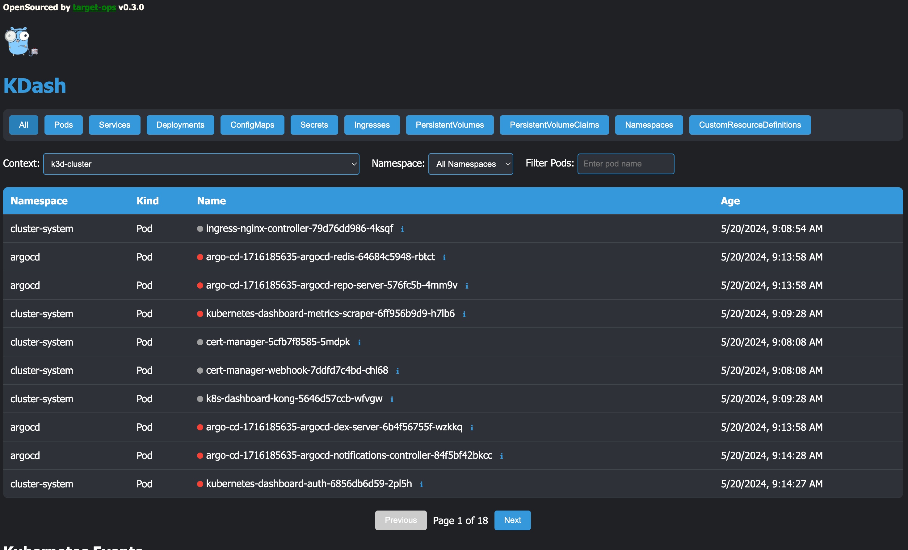

# 🚀 kdash


Welcome to **kdash**, a mini tool to pretty display your Kubernetes Context entities

## 🌟 Features

* Fast display of static context from kubernetes
* namespace selection 
* nothing else .... guys go easy on us we just started to pump this baby up :) 




## 📦 Installation

1. Clone the repository:
```
    git clone https://github.com/vladir/target-ops.git
```

2. Navigate to the `kdash` directory:
```
    cd target-ops/kdash
```

3. Build the project:
```
    go build
```

4. Run the executable:
```
    ./kdash
```

## 🚀 Usage

#### To use **kdash**, follow these steps:
Run the executable from path in installation step:

```
    ./kdash
```

## 💡 Contributing

We welcome contributions from the community! Feel free to fork the repository and submit pull requests. To contribute, follow these steps:

1. Fork the repository.
2. Create a new branch: 
```
    git checkout -b my-feature-branch
```

3. Make your changes and commit them:
```
    git commit -m 'Add some feature'
```

4. Push to the branch:
```
    git push origin my-feature-branch
```

5. Submit a pull request.

## Core required for ghpage

To generate an HTML version of this README, you can use the `github-readme-to-html` tool. Follow these steps:

1. Install `github-readme-to-html`:
```
    npm install -g github-readme-to-html
```

2. Convert the README to HTML:
```
    npx github-readme-to-html README.md
```

3. Copy the generated `index.html` file to the root directory:
```
    cp dist/index.html ./README.html && rm -rf ./dist/
```

Now you can open the `README.html` file in your browser to view the HTML version of this README.


## 💡 Contributing
We welcome contributions from the community! Feel free to fork the repository and submit pull requests.
```
Fork the repository.
Create a new branch: git checkout -b my-feature-branch.
Make your changes and commit them: git commit -m 'Add some feature'.
Push to the branch: git push origin my-feature-branch.
Submit a pull request.
```
## Core required for ghpage
https://github.com/jrnewton/github-readme-to-html 
```
npx github-readme-to-html README.md
cp dist/index.html ./README.html && rm -rf ./dist/
```
